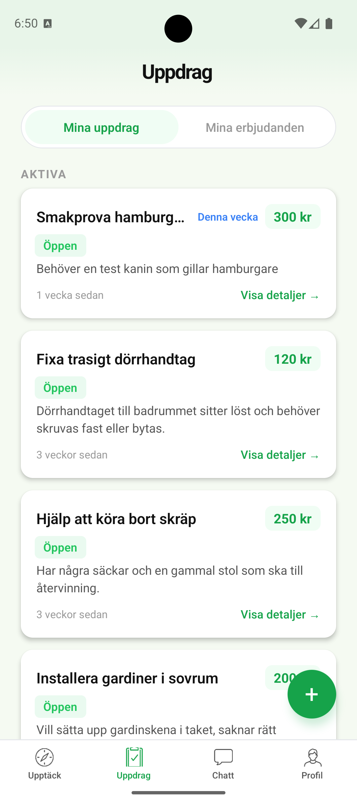
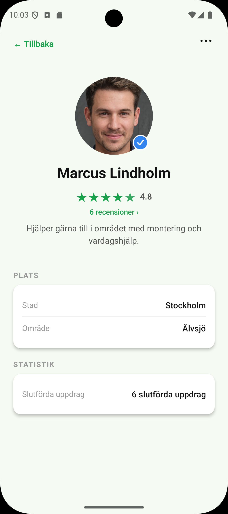

# GrannFix 🏠

**Quick help from your neighbors.** GrannFix connects people who need help with everyday tasks — carrying, mounting, moving — with reliable helpers nearby.

> 📱 React Native (Expo) · ☕ Spring Boot · 🐘 PostgreSQL

---

## Screenshots

<!-- Add screenshots here -->
<!-- | Discover | Tasks | Chat | Profile |
|----------|-------|------|---------|
|  |  |  |  | -->

*Screenshots coming soon*

---

## What can you do?

🔍 **Find help** — Browse tasks near you, filter by category

📦 **Post a task** — Describe what you need, pick a category and price

💬 **Chat** — Talk directly with the helper before and during the task

⭐ **Rate** — Leave a star rating after the task is completed

🔔 **Push notifications** — Never miss a new offer or message

🌙 **Dark mode** — Full dark theme support across the app

---

## Tech Stack

| Layer | Technology |
|-------|------------|
| **Mobile** | React Native, Expo, TypeScript, Expo Router |
| **Backend** | Java 17, Spring Boot 4, Spring Security |
| **Database** | PostgreSQL |
| **Push** | Firebase Cloud Messaging (FCM) |
| **Email** | Resend SMTP |
| **Auth** | JWT (access 15 min + refresh 30 days) |
| **API** | REST, OpenAPI 3.0, auto-generated TypeScript client |

## Architecture

```
GrannFix/
├── backend/          # Modular monolith (Spring Boot)
│   ├── auth/         # JWT, OTP, password reset
│   ├── user/         # Profiles, admin
│   ├── task/         # Tasks, categories, search
│   ├── offer/        # Offers, ratings
│   ├── chat/         # Messages
│   └── notification/ # Push (FCM)
└── mobile/           # React Native (Expo)
    ├── app/          # Screens (Expo Router)
    ├── src/api/      # Auto-generated API client
    ├── src/context/  # User, Theme
    └── src/components/ # TaskCard, Skeleton, ErrorBoundary
```

---

## Getting Started

### Backend

```bash
cd backend
./mvnw spring-boot:run
```

Create `backend/src/main/resources/application-local.properties`:

```properties
spring.datasource.password=your_db_password
spring.mail.password=your_resend_api_key
```

### Mobile

```bash
cd mobile
npm install
npm start
```

Update the API base URL in `mobile/src/api/client.ts`.

### API Documentation

Swagger UI: `/swagger-ui.html` · OpenAPI spec: `/v3/api-docs`

Regenerate client after backend changes: `npm run generate-api`

---

## License

Private — all rights reserved.
